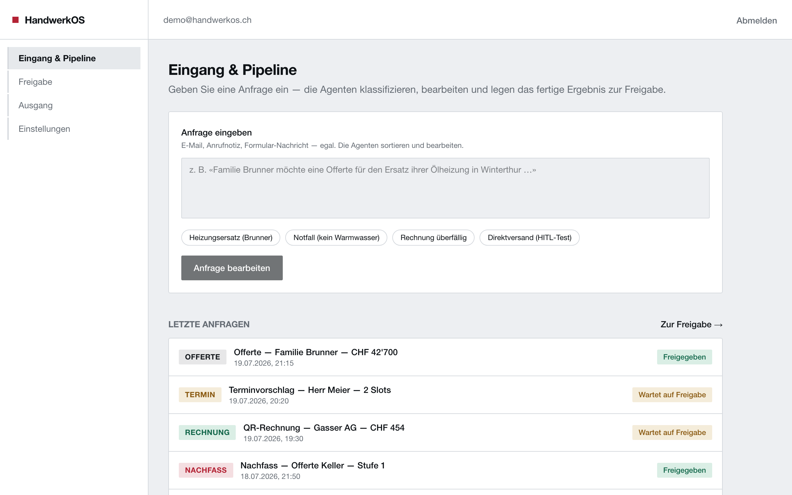
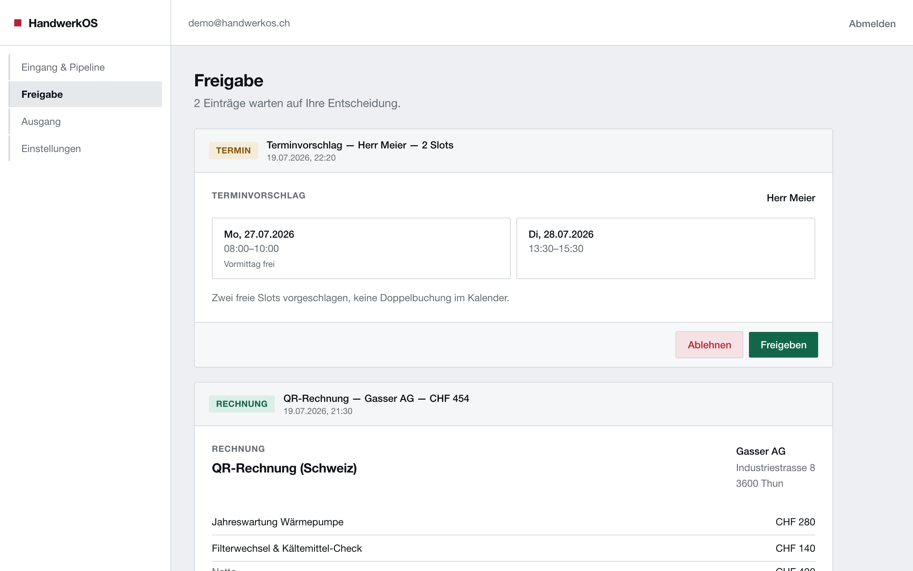
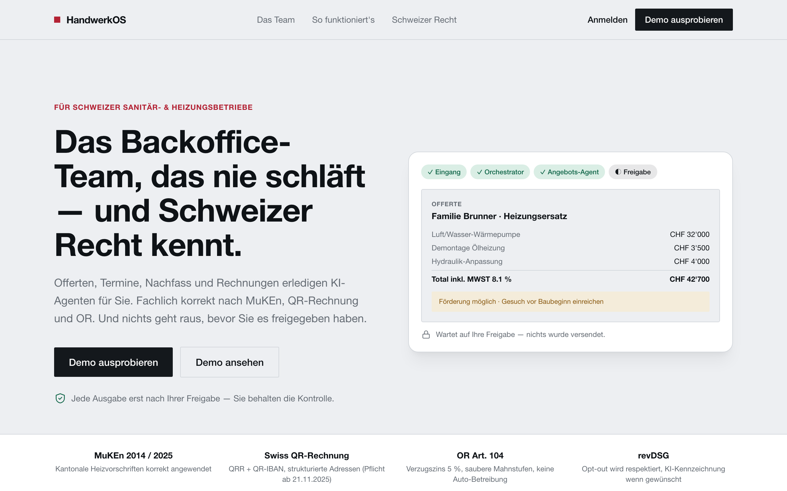

# 🔧 HandwerkOS

**Handwerksbetriebe ertrinken im Backoffice — Offerten, Termine, Rechnungen, Nachfass. HandwerkOS ist ein Backoffice aus KI-Agenten, das genau diese Aufgaben übernimmt: ein Orchestrator liest jede Anfrage und gibt sie an den richtigen Spezialisten weiter. Nichts geht raus ohne Freigabe.**
_Trade businesses drown in back-office work — quotes, scheduling, invoices, follow-ups. HandwerkOS is an AI-agent back-office that takes over exactly these tasks: an orchestrator reads every request and routes it to the right specialist. Nothing goes out without human approval._

> ℹ️ **Schaufenster / Showcase:** Live-Demo + Screenshots. Der Quellcode (Agenten-Prompts, Business-Logik) ist privat. / Live demo + screenshots; source code (agent prompts, business logic) is private.

### 🔗 [Live-Demo ausprobieren →](https://handwerkos-app.vercel.app)
Demo-Login ist vorausgefüllt — direkt reinklicken. / Demo login is pre-filled — just click in.

---

## 🇩🇪 Deutsch

### Das Problem
Handwerksbetriebe (Sanitär, Heizung, Wärmepumpe) ertrinken im Backoffice: Offerten schreiben, Termine koordinieren, Rechnungen stellen, säumigen Zahlungen nachgehen — alles fachlich heikel und zeitfressend.

### Die Lösung
Ein **Team aus KI-Agenten**, das genau diese Aufgaben übernimmt:
- **Orchestrator** — liest jede eingehende Anfrage, erkennt worum es geht, leitet weiter
- **Angebots-Agent** — fachlich korrekte Offerten (Wärmepumpe statt Öl, Förderung, MWST 8.1 %, «Gesuch vor Baubeginn»)
- **Termin-Agent** — schlägt Slots vor, erkennt Notfälle, verhindert Doppelbuchungen
- **Nachfass-Agent** — hakt höflich bei offenen Offerten nach, stoppt bei Absage/Opt-out
- **Rechnungs-Agent** — Swiss-QR-Rechnung, korrekte Mahnstufen nach OR

### Das Besondere
- **Human-in-the-Loop:** Kein Dokument verlässt das System ohne Freigabe durch den Betrieb.
- **Schweizer Recht fest eingebaut:** MuKEn, Swiss-QR, OR-Verzugszins, revDSG — mit harten Prüf-Gates, die falsche Ausgaben blockieren.

## 🇬🇧 English

### The problem
Trade businesses (plumbing, heating, heat pumps) drown in back-office work: writing quotes, scheduling, invoicing, chasing late payments — all technically sensitive and time-consuming.

### The solution
A **team of AI agents** that takes over exactly these tasks: an **orchestrator** routes each request to the right specialist — quotes, scheduling, follow-ups, Swiss QR invoices — each correct under Swiss law.

### What makes it special
- **Human-in-the-loop:** no document leaves the system without the business's approval.
- **Swiss law built in:** hard validation gates block incorrect outputs.

---

## 📸 Screenshots
| Freigabe (Human-in-the-Loop) | Landingpage |
|---|---|
|  |  |

## Tech
`Next.js` · `TypeScript` · `Prisma` · `Auth.js` · `Anthropic API (Multi-Agent)` · `Vercel`
